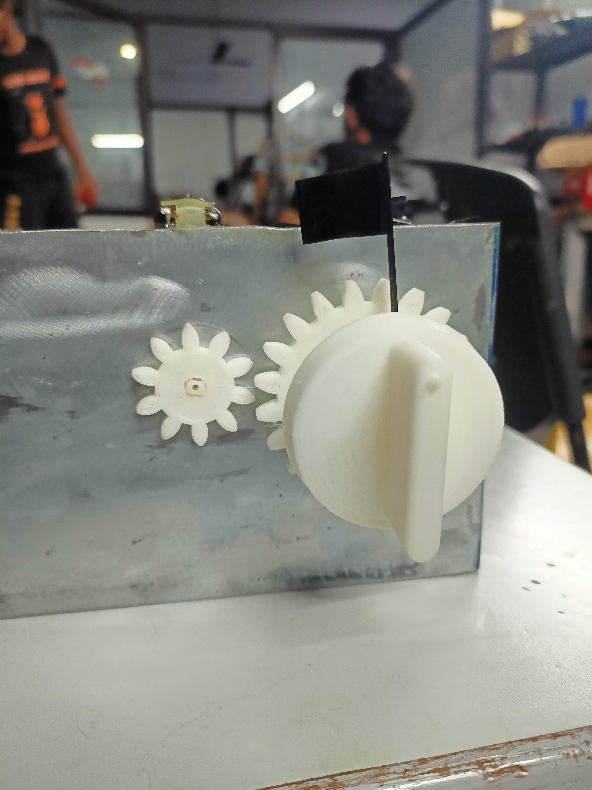
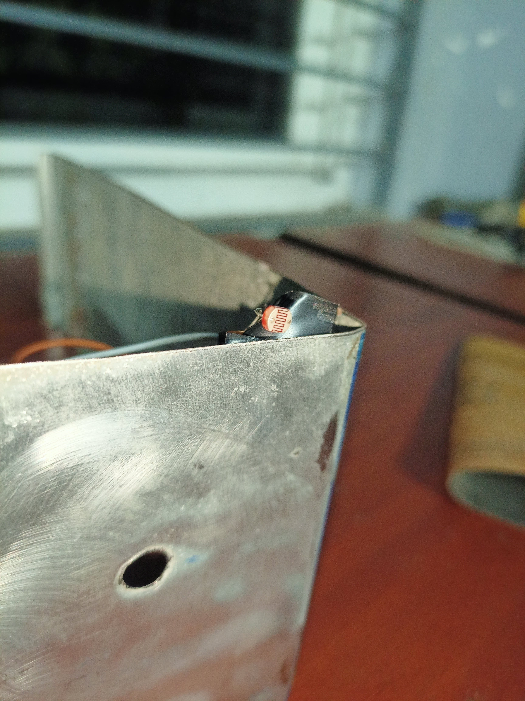

# Automatic Shutoff Safety System for Gas Stoves

**Self Project**

## Overview

A mechanical-electronic safety system developed for a conventional gas stove to automatically shut off the stove after a predetermined duration.

The system combines **mechanical actuation, optical sensing, embedded control, and a timed shutoff mechanism** to detect whether the stove is operating and automatically return the stove knob to the OFF position after the selected duration.

The system was conceived as a potential **standard safety feature for conventional gas stoves**, with the aim of reducing accidents caused by a stove being unintentionally left running due to forgetfulness or inattention.

## How It Works

The system operates through a simple sensing, timing, and actuation sequence:

1. **Stove OFF — LDR blocked**

   A small flag/fixture attached to the stove knob spindle is positioned between an LED and an LDR (Light Dependent Resistor). When the stove is OFF, the flag blocks the LED's light from reaching the LDR.

2. **Stove turned ON — LDR exposed**

   When the stove knob is rotated to turn the stove ON, the spindle rotates along with the attached flag. The flag moves away from the LDR, exposing it to the LED.

3. **State detection**

   The change in illumination is detected by the LDR and read as a logic HIGH (`1`) by the Arduino, indicating that the stove has been switched ON.

4. **Timer starts**

   Once the ON state is detected, the Arduino starts the preset shutoff timer. The default timer duration is **10 minutes**.

5. **Automatic shutoff**

   When the timer expires, the Arduino activates a DC motor. The motor drives a smaller gear which engages with a larger gear attached to the stove knob spindle.

6. **Knob returns to OFF**

   The gear mechanism rotates the stove spindle back toward its OFF position, closing the gas valve and shutting off the stove.

7. **Reset**

   Once the stove has been returned to the OFF state, the sensing mechanism returns to its initial position, ready for the next operation.

### System Flow

**Stove ON → LDR detects spindle position → Arduino → 10-minute timer → DC motor → Gear mechanism → Knob returns to OFF → Gas valve closes**

## Key Features

* Automatic shutoff after a predetermined duration
* **10-minute default safety timer**
* LDR-LED based detection of stove knob position
* Mechanical flag/fixture coupled to the knob spindle for optical state detection
* Arduino-based control
* Gear-driven DC motor for mechanical valve actuation
* Adjustable shutoff duration
* Display interface for timer setting and monitoring
* Additional **cook-assist functionality** for timed cooking

## Mechanical Actuation

The shutoff mechanism uses a pair of gears to transfer motion from the DC motor to the stove knob spindle.

A **larger gear is attached directly to the spindle of the stove knob**, while a smaller gear is connected to the shaft of the DC motor. When the Arduino commands the motor, the smaller gear drives the larger gear and rotates the spindle back toward the OFF position.

This arrangement allows the motor to provide the required rotational motion while keeping the sensing and actuation mechanisms mechanically coupled to the stove's existing control.

## Optical Sensing Mechanism

The stove's operating state is detected without requiring a direct electrical connection to the stove's valve or ignition system.

An LED and LDR are positioned with a small mechanical flag attached to the knob spindle between them.

* **OFF position:** flag blocks the LED → LDR remains unexposed
* **ON position:** spindle rotates → flag moves away → LDR is exposed to the LED
* **Arduino input:** change in LDR state indicates that the stove has been switched ON

### LDR Test

The sensing mechanism was tested independently to verify reliable detection of the knob position.

[▶ LDR sensing test video](LDR%20test.mp4)

## Timer and Cook-Assist Mode

The system uses an adjustable timer with a display, allowing the shutoff duration to be changed from the default safety setting.

This provides a secondary **cook-assist function**: instead of simply using the system as an unattended-stove safety mechanism, a user can select a desired cooking duration and allow the system to automatically shut off the stove when the timer expires.

The timer therefore provides two modes of use:

* **Safety mode:** automatic shutoff after a predetermined duration
* **Cook-assist mode:** user-selected shutoff duration for timed cooking

## System Demonstration

The prototype integrates the optical sensing mechanism, Arduino-based controller, timer/display interface, and motor-driven gear mechanism into a single system.

[▶ Watch the complete system demonstration](Demonstration.mp4)

## Motivation

The primary motivation for the project was to explore whether an automatic shutoff mechanism could be incorporated as a **standard safety feature on conventional gas stoves**.

Accidentally leaving a stove running due to forgetfulness or inattention can create a significant safety risk. By continuously monitoring the stove's operating state and automatically returning the control knob to the OFF position after a predetermined duration, the system provides an additional layer of protection without requiring changes to the fundamental operation of the stove.

The adjustable timer also extends the concept beyond safety into a practical timed-cooking aid.

## Technologies & Concepts

**Mechanical:**
Gear transmission · Rotary actuation · Mechanical sensing mechanism

**Electronics:**
LDR · LED · DC motor · Arduino · PWM control · Display

**Control:**
Digital state detection · Timer-based control · Motor actuation

**Application:**
Domestic appliance safety · Automatic shutoff · Cook-assist functionality

---

**Project Type:** Self Project
**Domain:** Mechanical Design · Electronics · Embedded Systems · Product Safety
